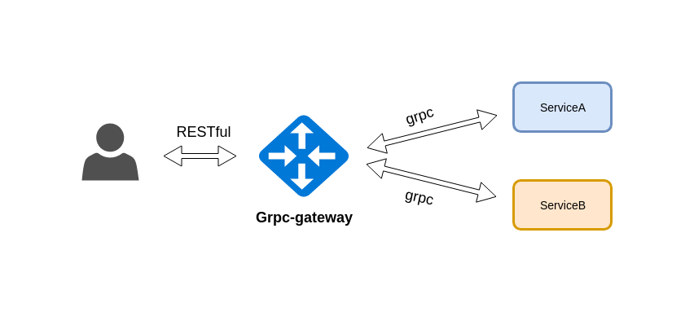

# grpc-gateway

- [grpc-gateway](#grpc-gateway)
  - [Overview](#Overview)
  - [Architecture Demo](#Architecture-Demo)
  - [Run](#Run)
  - [Test](#Test)
  - [Ref](#Ref)

## Overview

Building grpc-gateway has caused many difficulties for developers such as the installation of the Golang programming environment, protobuf, how to build,.... There is a simpler, less time-consuming solution that uses `Build grpc-gateway`.
  
## Architecture Demo

<p align="center">
  
</p>
  
## Run
 - Run grpc-gateway
 ```shell script
    cd ./grpc-gateway/gateway/api/proto/gen/grpc-gateway/src/pkg/main
    go run main.go
 ```
 - Run service  
 ```shell script
    cd ./grpc-gateway/service/cmd/server
    go run main.go
 ```

## Test

- Test ServiceA
  
```sh
$ curl -X GET "http://localhost:9000/core/serviceA/ping/999999"
{"timestamp":"1560311912214","serviceName":"service A"}
```

- Test ServiceB

```sh
curl -X GET "http://localhost:9000/core/serviceB/ping/999999"
{"timestamp":"1560312187849","serviceName":"service B"}
```

## Ref
```link
https://github.com/grpc-ecosystem/grpc-gateway
```